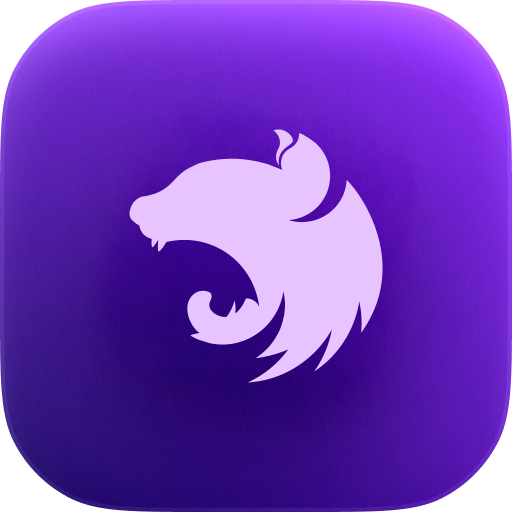

<p align="center">
  <p align="center">
	
  </p>
  <h1 align="center"><b>Charmed NestJS Icons</b></h1>
  <p align="center"><b>Original icons by littensy, Fork by aaa-lt</b></p>
</p>

<div align="center">

[](LICENSE.md)


</div>

## 📷 Previews

<details>
  <summary>🫐 Base</summary>
  
</details>
<details>
  <summary>🥥 Light</summary>
  
</details>
<details>
  <summary>🍇 Soft</summary>
  
</details>
<details>
  <summary>🍓 Warm</summary>
  
</details>

## 🔧 Usage

### Marketplace

You can find my icons on the [VS Code Marketplace](https://marketplace.visualstudio.com/items?itemName=littensy.charmed-icons) or on the [Open VSX Registry](https://open-vsx.org/extension/littensy/charmed-icons).

### Manual

1. Download the `.vsix` file from the [Releases](https://github.com/littensy/charmed-icons/releases) page.
2. Open the Command Palette (`Ctrl+Shift+P` or `Cmd+Shift+P`) in VS Code.
3. Run the `Extensions: Install from VSIX...` command.

## 🎨 Customization

### Settings

You can customize the icon theme with the following settings:

```jsonc
{
	// Set to `true` to disable folding arrows next to folder icons.
	"charmed-icons.hidesExplorerArrows": false,

	// Set to `when-expanded` to use outlines when the folder is expanded.
	// Set to `always` to always use outlined folder icons.
	// Set to `never` to always use filled folder icons.
	"charmed-icons.outlinedFolders": "when-expanded"
}
```

### Custom icon associations

Charmed Icons also supports custom icon associations (thanks to [Catppuccin Icons](https://github.com/catppuccin/vscode-icons/tree/main?tab=readme-ov-file#custom-icon-associations)):

```jsonc
{
	// Files with the language type `typescriptreact` will have the `react-typescript` icon.
	"charmed-icons.associations.languages": {
		"typescriptreact": "react-typescript"
	},

	// Files with the `spec.ts` extension will have the `test-blue` icon.
	"charmed-icons.associations.extensions": {
		"spec.ts": "test-blue"
	},

	// Files with the name `vite.config.ts` will have the `vite` icon.
	"charmed-icons.associations.files": {
		"vite.config.ts": "vite"
	},

	// Folders with the name `typings/` will have the `folder_types` icon.
	"charmed-icons.associations.folders": {
		"typings": "folder_types"
	}
}
```

> [!NOTE]
> See the [preview images](#-previews) for a list of available icons.

---

<p align="center">
Charmed Icons is released under the <a href="LICENSE.md">MIT License</a>.
</p>

<div align="center">

[](LICENSE.md)

</div>
